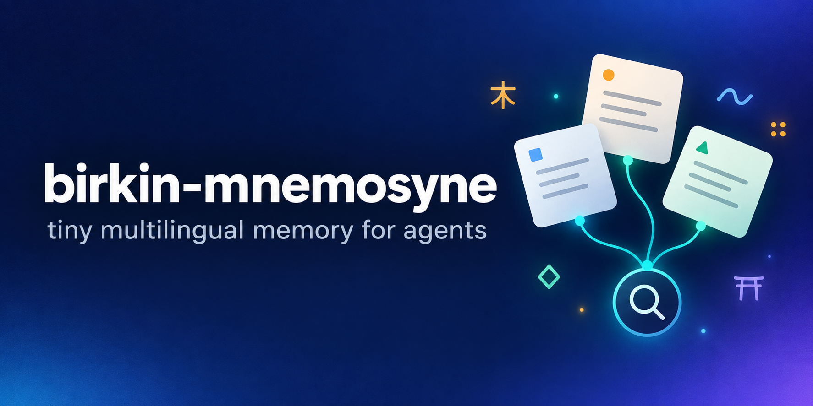

# birkin-mnemosyne

birkin-mnemosyne is local Markdown memory for personal agents: multilingual
BM25 retrieval, usage-driven decay and zone priorities, plus provider-portable
curation whose file operations are bounded by a deterministic executor. The
core has zero runtime dependencies and needs no model or API key to store or
search notes. Notes stay readable, greppable and diffable; an optional MCP
server connects the vault to agent clients, and an opt-in semantic mode adds
meaning-based retrieval.

## Install

Requires Python >= 3.10. Install from PyPI:

```bash
pip install birkin-mnemosyne
```

From a checkout, the existing development and benchmark commands are:

```bash
pip install -e .                 # standard-library-only core
pip install -e ".[dev]"          # pytest, ruff
pip install -e ".[bench]"        # fastembed, numpy: embedding baselines only
pip install -e ".[mcp]"          # official MCP SDK and server
pip install -e ".[semantic]"     # optional meaning-based retrieval
```

The extras are optional. `[bench]` reproduces embedding baselines; it does
not enable semantic retrieval. See below for explicit semantic preparation.

## 30-second usage

```python
from birkin_mnemosyne import VaultMemory

mem = VaultMemory({"vault_path": "my_vault"})
mem.write_note(
    "Ingress DNS",
    "nginx ingress resolves service DNS; allow HTTPS through the firewall.",
    zone="devops",
)
for hit in mem.dex.search("ingress dns"):
    print(hit)
# Reinforce the note your agent actually used, not every search candidate.
mem.dex.record_access("ingress-dns")
```

For an existing vault, use `Mnemosyne("my_vault")`, call `refresh()`, then
`search(query)`. Unicode normalization, accent folding, Latin prefix stems,
and Hangul/Han/kana bigrams support multilingual lexical matching. File
changes refresh the index: notes written through the library are searchable
at once, and `search()` looks for edits made outside it (for example in
Obsidian) at most once every 2 seconds (`refresh()` looks immediately). The
compressed cache is rebuildable, while usage
history persists separately. Usage decay and zone activity adjust ranking.

### Widen a query at search time (optional)

Matching is lexical, so a question worded differently from the note can miss
it. A host model can widen its own query when it searches. Nothing is stored,
the index is untouched, and a search without `expansions` ranks as before:

```python
mem.search(
    "why can't the pods find each other by name",
    expansions={
        "synonyms": ["service discovery", "name resolution"],  # weight 0.75
        "keywords": ["Namensauflösung", "Dienst"],   # 0.75: your other language(s)
        "related": ["ingress", "firewall"],                    # 0.4
        "note_line": "The ingress resolves service DNS names.",  # 0.4
    },
)
```

The query's own words weigh 1.0, and a note that contains all of them stays
first. Over MCP the same four fields are parameters of `memory_search`. On
the benchmark's test split at 10,000 notes, expansions written by two models
that saw only the question moved paraphrase MRR from 0.205 to 0.981 and
0.952. Questions and expansions are both model-written, so read that as an
upper bound: see
[Search-time query expansion](benchmarks/retrieval/RESULTS.md#search-time-query-expansion-core-zero-dependencies-opt-in-per-search).

## What the numbers say

All retrieval quality below is the **final frozen test split**, copied from
[RESULTS.md](benchmarks/retrieval/RESULTS.md#optional-semantic-mode-semantic-extra).
The synthetic corpus has 160 gold notes in six languages, padded with
invented distractors to 1,000 and 10,000 notes. **Three independent query
authors** (claude-opus-5.5, gpt-6.1-sol, claude-fable-5.1) supply exact,
low-overlap paraphrase and code-switched questions. Cross-language sibling
notes are removed before scoring; tuning uses dev only.

MRR measures how early the correct note appears; R@5 measures whether it is
in the first five hits. Higher is better. Each arrow is **default core ->
optional semantic mode**, not an earlier draft result. Bold values mark a
loss. Language codes: en English, ko Korean, ja Japanese, zh Chinese,
es Spanish, de German.

### Per language, all query kinds

#### 160 notes

| Language | MRR: core -> semantic | R@5: core -> semantic |
|---|---|---|
| en | 0.591 -> 0.640 | 0.698 -> 0.746 |
| ko | 0.579 -> 0.640 | 0.654 -> 0.728 |
| ja | 0.794 -> 0.843 | 0.848 -> 0.899 |
| zh | 0.818 -> 0.871 | 0.867 -> 0.926 |
| es | 0.698 -> 0.744 | 0.769 -> 0.861 |
| de | 0.689 -> 0.749 | 0.756 -> 0.822 |

#### 1,000 notes

| Language | MRR: core -> semantic | R@5: core -> semantic |
|---|---|---|
| en | 0.581 -> 0.620 | 0.679 -> 0.714 |
| ko | 0.554 -> 0.614 | 0.613 -> 0.683 |
| ja | 0.782 -> 0.809 | 0.848 -> 0.909 |
| zh | 0.766 -> 0.823 | 0.830 -> 0.881 |
| es | 0.655 -> 0.686 | 0.694 -> 0.713 |
| de | 0.664 -> 0.708 | 0.741 -> 0.770 |

#### 10,000 notes

| Language | MRR: core -> semantic | R@5: core -> semantic |
|---|---|---|
| en | 0.568 -> 0.604 | 0.655 -> 0.675 |
| ko | 0.559 -> 0.608 | 0.609 -> 0.658 |
| ja | 0.782 -> 0.816 | 0.848 -> 0.879 |
| zh | 0.764 -> 0.782 | **0.822 -> 0.815** |
| es | 0.673 -> 0.681 | 0.704 -> 0.704 |
| de | 0.681 -> 0.708 | 0.741 -> 0.748 |

### Per independent query author and language

These MRR tables keep every author and corpus size separate. Semantic mode
loses Spanish MRR for claude-opus-5.5 at 1,000 and 10,000 notes, and Chinese
MRR for gpt-6.1-sol at 10,000 notes; those cells are bold, not averaged away.

#### claude-opus-5.5

| Notes | Language | Core MRR | Semantic MRR |
|---|---|---|---|
| 160 | en | 0.606 | 0.672 |
| 160 | ko | 0.597 | 0.668 |
| 160 | ja | 0.773 | 0.812 |
| 160 | zh | 0.820 | 0.852 |
| 160 | es | 0.692 | 0.707 |
| 160 | de | 0.694 | 0.739 |
| 1000 | en | 0.592 | 0.644 |
| 1000 | ko | 0.565 | 0.622 |
| 1000 | ja | 0.784 | 0.795 |
| 1000 | zh | 0.750 | 0.794 |
| 1000 | es | 0.653 | **0.646** |
| 1000 | de | 0.671 | 0.692 |
| 10000 | en | 0.588 | 0.639 |
| 10000 | ko | 0.570 | 0.608 |
| 10000 | ja | 0.763 | 0.828 |
| 10000 | zh | 0.746 | 0.764 |
| 10000 | es | 0.653 | **0.639** |
| 10000 | de | 0.671 | 0.687 |

#### gpt-6.1-sol

| Notes | Language | Core MRR | Semantic MRR |
|---|---|---|---|
| 160 | en | 0.524 | 0.559 |
| 160 | ko | 0.612 | 0.671 |
| 160 | ja | 0.827 | 0.840 |
| 160 | zh | 0.811 | 0.877 |
| 160 | es | 0.628 | 0.711 |
| 160 | de | 0.612 | 0.663 |
| 1000 | en | 0.512 | 0.542 |
| 1000 | ko | 0.609 | 0.674 |
| 1000 | ja | 0.821 | 0.851 |
| 1000 | zh | 0.762 | 0.847 |
| 1000 | es | 0.577 | 0.652 |
| 1000 | de | 0.595 | 0.629 |
| 10000 | en | 0.496 | 0.517 |
| 10000 | ko | 0.613 | 0.668 |
| 10000 | ja | 0.826 | 0.828 |
| 10000 | zh | 0.777 | **0.776** |
| 10000 | es | 0.609 | 0.643 |
| 10000 | de | 0.622 | 0.648 |

#### claude-fable-5.1

| Notes | Language | Core MRR | Semantic MRR |
|---|---|---|---|
| 160 | en | 0.643 | 0.691 |
| 160 | ko | 0.530 | 0.581 |
| 160 | ja | 0.781 | 0.876 |
| 160 | zh | 0.822 | 0.884 |
| 160 | es | 0.775 | 0.814 |
| 160 | de | 0.761 | 0.844 |
| 1000 | en | 0.641 | 0.673 |
| 1000 | ko | 0.487 | 0.548 |
| 1000 | ja | 0.742 | 0.781 |
| 1000 | zh | 0.785 | 0.829 |
| 1000 | es | 0.736 | 0.761 |
| 1000 | de | 0.726 | 0.804 |
| 10000 | en | 0.621 | 0.655 |
| 10000 | ko | 0.493 | 0.548 |
| 10000 | ja | 0.759 | 0.790 |
| 10000 | zh | 0.770 | 0.807 |
| 10000 | es | 0.756 | 0.763 |
| 10000 | de | 0.749 | 0.787 |

The Chinese author-level R@5 losses at 10,000 notes are also explicit:

| Author | R@5: core -> semantic |
|---|---|
| claude-fable-5.1 | **0.867 -> 0.844** |
| gpt-6.1-sol | **0.822 -> 0.800** |

### Where semantic mode falls below the core

**The mode is opt-in and is not the recommended default.** The bar was
"no slice below the core". It misses that bar on the test split in one
pooled slice, three author slices and six language x kind cells. The pooled
Chinese and author losses are above; every language x kind loss is below.
`mixed` means code-switched; `para` means low-overlap paraphrase.

| Notes | Language / kind | MRR: core -> semantic | R@5: core -> semantic |
|---|---|---|---|
| 160 | ja / mixed | **0.896 -> 0.886** | 0.970 -> 0.970 |
| 160 | zh / mixed | **0.917 -> 0.905** | **0.978 -> 0.956** |
| 1000 | ja / mixed | **0.865 -> 0.826** | 0.970 -> 0.970 |
| 10000 | ja / mixed | **0.880 -> 0.859** | 0.970 -> 0.970 |
| 10000 | zh / mixed | **0.875 -> 0.860** | 0.911 -> 0.911 |
| 10000 | zh / para | 0.418 -> 0.487 | **0.556 -> 0.533** |

The configuration passed the dev gate, was frozen before this test run and
was not retuned afterward. Exact keyword queries keep their lexical order;
no exact query moved at any corpus size. Turn semantic mode on when questions
are usually worded differently from the notes; leave it off when lookups are
mostly keywords.

### Footprint

Apple M1, macOS arm64 measurements, not service-level guarantees. Every arrow
is **core -> semantic**. Install size is **0.18 MB -> 38.2 MB**, including the
extra's dependencies but not the prepared model. The first preparation needs
an approximately 530 MB download; the compact model is approximately 140 MB
on disk. The memory budget was 150 MB on top of the core; the largest measured
addition was 61 MB while indexing. The prepared-model start-up budget was
1 s; the slowest semantic start in the reference timing run took 439 ms.

#### Index and memory

| Notes | Index on disk | RSS: search | RSS: indexing |
|---|---|---|---|
| 160 | 0.07 MB -> 0.09 MB | 25 -> 48 MB | 26 -> 83 MB |
| 1000 | 0.35 MB -> 0.43 MB | 34 -> 56 MB | 40 -> 101 MB |
| 10000 | 3.27 MB -> 4.08 MB | 138 -> 159 MB | 170 -> 231 MB |

#### Start-up and latency

| Notes | Start-up median (max) | p50 | p95 |
|---|---|---|---|
| 160 | 41 ms (42) -> 89 ms (95) | 0.5 -> 1.6 ms | 0.6 -> 3.4 ms |
| 1000 | 65 ms (98) -> 125 ms (132) | 3.1 -> 7.4 ms | 3.9 -> 8.4 ms |
| 10000 | 307 ms (547) -> 382 ms (439) | 35.4 -> 75.6 ms | 37.8 -> 79.4 ms |

RSS is peak resident memory in separate fresh processes for search and
whole-vault indexing. Start-up includes interpreter start, import, index load
and first query. Reference timings were measured at a lower machine load
(1-minute load average 5.6 to 7.8), using 10 processes per start-up cell and
300 test queries in a warm process. Latency grows with vault size and machine
load. The timing fields in `semantic_test_run.json` are **not** the reference;
use the separately measured start-up and latency table in RESULTS.md.

## Honest limits

- **Korean does not improve in the default core.** Against the earlier
  tokenizer, at 10,000 notes its MRR is **0.569 -> 0.559**. English stems also
  match English distractors for code-switched Korean questions; Korean
  tokenization itself is unchanged. Stem reweighting traded English for
  Korean, and a minority-script boost hurt independently authored mirror
  questions. Neither was shipped: see
  [Code-switched queries in the core](benchmarks/retrieval/RESULTS.md#code-switched-queries-in-the-core-measured-not-changed).
- **This is a synthetic personal-scale benchmark.** It does not establish
  superiority over other memory projects, answer accuracy, or universal
  multilingual coverage. Low-overlap paraphrases remain difficult for the
  lexical core. Scripts with combining vowel signs, such as Devanagari and
  Thai, are split at those signs by the current tokenizer.
- **Query expansion is only as good as its writer.** The expansion numbers
  come from model-written questions and model-written expansions. With one of
  the two writers, code-switched questions about Spanish and German notes fell
  about 0.05 MRR below the core, because it answered in English and Korean.
  Each widened search costs the host about 115-200 output tokens and about
  twice the ranking time.
- **Semantic results can be irrelevant.** With the mode on, even a query
  without a lexical match receives semantic candidates; there is no relevance
  floor. Tokenizer equivalence was checked on this benchmark only, and memory
  in a long-lived process with varied CJK text was not measured. Footprint
  measurements cover macOS arm64 only.
- **Compression has a write cost.** Saving recompresses the whole index;
  loading briefly holds compressed and decoded text together. Mixing older
  and newer library versions on a vault causes repeated cache rebuilding.
- **Curation safety is narrower than correctness.** The executor bounds file
  operations; model choice still affects placement and linking quality.
  Python's explicit `purge_expired()` maintenance call can delete expired
  notes and is not exposed over MCP.
- The earlier LongMemEval retrieval and end-to-end QA harnesses are **not yet
  public** in this repository. Their numbers are omitted here. The companion
  paper is not a substitute for a committed reproduction harness.

## Reproduce the benchmark

Core (no optional runtime dependencies):

```bash
python benchmarks/retrieval/bench_retrieval.py --sizes 160 1000 10000 --install-size
```

Search-time query expansion, replaying the committed expansions of two
writers (no model call, no optional dependency):

```bash
python benchmarks/retrieval/bench_retrieval.py --engines bm25 expanded-claude expanded-gpt --sizes 160 1000 10000 --json run.json
python benchmarks/retrieval/compare.py run.json run.json --engine-before bm25 --engine-after expanded-claude
```

Semantic mode uses `minishlab/potion-multilingual-128M` static embeddings,
with no transformer at query time. Install the extra and explicitly prepare
its model once:

```bash
pip install "birkin-mnemosyne[semantic]"
python -m birkin_mnemosyne.semantic
```

Opt in with `Mnemosyne(vault, semantic=True)` or `MNEMOSYNE_SEMANTIC=1`.
Search never downloads or converts a model. If requested with the extra
missing or the model unprepared, search uses the core ranking and logs one
line explaining why. Semantic chunks are fused with lexical ranking;
full lexical matches stay first and fused ties use lexical rank.

From a checkout with the model prepared:

```bash
python benchmarks/retrieval/bench_retrieval.py --engines bm25 hybrid --sizes 160 1000 10000 --json run.json --install-size --install-extras semantic
python benchmarks/retrieval/compare.py run.json run.json --engine-before bm25 --engine-after hybrid
```

The committed quality run is
[semantic_test_run.json](benchmarks/retrieval/semantic_test_run.json).
See RESULTS.md for the full query-kind tables, query counts, rejected ideas
and footprint methodology. Additional checks and offline examples:

```bash
pytest -q                                # MCP tests skip without [mcp]
python examples/quickstart.py            # write, search, decay
python examples/automatic_profiles.py    # profile review and persistence
python benchmarks/bench_safety_matrix.py # defense-layer ablation
python benchmarks/bench_korean_embed.py  # embedding baseline; needs [bench]
```

## CurationPlan/1: bounded curation with any model

A model proposes typed JSON operations (rezone, link, supersede, archive);
a deterministic executor validates, clamps, applies and audits them. The
curation schema has no delete operation: archive moves a note. Archives are
capped per pass using `ARCHIVE_CAP_MIN` and `ARCHIVE_CAP_FRACTION` of active
notes; negative-polarity warnings and control notes are protected. Every move
stays inside the vault, `_archive` is not an active zone, and free-text
summaries are inert rather than control signals. Unparseable output becomes
an empty plan. Placement is model judgment; linking co-placed notes is
mechanical. Schema validation alone does not prevent mass archiving; the
executor's clamp does. Path containment and slug lookup also protect the
lower-level file operations.

```python
from pathlib import Path

from birkin_mnemosyne import Mnemosyne, run_curation_pass, get_completer

vault = Path("my_vault")
mem = Mnemosyne(vault)
mem.refresh()
hits = mem.search("kubernetes ingress dns")

# the vault argument must be a pathlib.Path
outcome = run_curation_pass(vault, get_completer("codex"), provider="codex")
# Or pass your own complete(prompt: str) -> str callable.
```

For openclaw, hermes or your own loop, expose `mem.search(query)` as a recall
tool, call `mem.record_access(note_slug)` for notes actually used, and pass
your existing model client to `run_curation_pass(vault_path, my_complete,
provider="custom")`. It returns a `CurationOutcome` with accepted/dropped
operations, archive cap and audit summary. Already have a plan as data?
`evaluate_plan(vault_path, plan)` runs the same gate as a dry run; pass
`apply=True` to apply it.

| Provider | Invocation | Plan constraint |
|---|---|---|
| `claude` | `claude -p`, empty tool allow-list | prompt-specified |
| `codex` | `codex exec --sandbox read-only --output-schema` | enforced JSON schema |
| `api` | Anthropic Messages API via stdlib `urllib` | prompt-specified |
| `gemini` | `gemini -p -`, CLI defaults | prompt-specified |
| `local` | `ollama run <model>` | prompt-specified |

## MCP server (Claude Code, Claude Desktop, Codex CLI, Cursor)

The vault can be served over the [Model Context Protocol](https://modelcontextprotocol.io)
so any MCP client can remember, recall and curate. The server is an optional
extra — the core library stays stdlib-only — and runs with one command over
stdio:

```bash
uvx --from "birkin-mnemosyne[mcp]" \
    mnemosyne-mcp --vault ~/mnemosyne
```

(or `pip install "birkin-mnemosyne[mcp]"`
and run `mnemosyne-mcp`). The first launch downloads the SDK; if your client
times out on that first start, run the command once in a terminal.

| setting | how |
|---|---|
| vault directory | `--vault PATH`, else `$MNEMOSYNE_VAULT`, else `~/.birkin-mnemosyne/vault` |
| require a `source` for new notes | `--evidence-required` or `MNEMOSYNE_EVIDENCE_REQUIRED=1` |
| protected-note budget (default 1000, `0` = no limit) | `--max-protected-notes N` or `MNEMOSYNE_MAX_PROTECTED_NOTES=N` |
| active-note byte budget (default 104857600, `0` = no limit) | `--max-vault-bytes N` or `MNEMOSYNE_MAX_VAULT_BYTES=N` |

**Claude Code**

```bash
claude mcp add --scope user mnemosyne -- \
  uvx --from "birkin-mnemosyne[mcp]" \
  mnemosyne-mcp --vault ~/mnemosyne
```

**Claude Desktop** (`claude_desktop_config.json`) and **Cursor**
(`~/.cursor/mcp.json` or `.cursor/mcp.json`) use the same shape:

```json
{
  "mcpServers": {
    "mnemosyne": {
      "command": "uvx",
      "args": [
        "--from", "birkin-mnemosyne[mcp]",
        "mnemosyne-mcp", "--vault", "~/mnemosyne"
      ]
    }
  }
}
```

**Codex CLI** (`~/.codex/config.toml`, or `codex mcp add mnemosyne -- uvx ...`):

```toml
[mcp_servers.mnemosyne]
command = "uvx"
args = ["--from", "birkin-mnemosyne[mcp]",
        "mnemosyne-mcp", "--vault", "~/mnemosyne"]
```

Point several clients at the same `--vault` to share one memory; writes are
serialized across server processes with a lock file.

### Tools

| tool | what it does | safe default |
|---|---|---|
| `memory_search` | BM25 + decay + zone ranked hits with snippets; optional `synonyms` / `keywords` / `related` / `note_line` widen the query | read-only |
| `memory_get_note` | full note with its `version`; counts as a use | — |
| `memory_list` | notes by zone, paginated | read-only |
| `memory_remember` | write a note: `mode="create"` / `"append"` / `"replace"` | `create` never overwrites; `replace` needs `expected_version` |
| `memory_related` | mechanical link candidates for a note | read-only |
| `memory_forget` | move a note to `_archive` through the curation gate | dry run unless `confirm=true`; never deletes |
| `memory_restore` | move a note back out of `_archive` | — |
| `memory_curation_catalog` | structured catalog for writing a CurationPlan | read-only |
| `memory_curate` | run a CurationPlan/1 through the deterministic gate | dry run unless `apply=true` |
| `memory_capacity` | active and protected note counts and index bytes against the budget | read-only |

Plus the resources `mnemosyne://digest` (the prompt digest) and
`mnemosyne://note/{slug}`, and the prompt `curate_vault`. The calling agent is
the curator: it reads the catalog, writes a plan, and `memory_curate` clamps it
exactly like `run_curation_pass` would — protected notes stay put and the
archive cap applies to every call. Nothing exposed over MCP can hard-delete a
file (`purge_expired` stays a Python-only maintenance call). Note text returned
by the tools is stored data from earlier sessions; the server tells clients
not to follow instructions found inside it.

**Capacity.** The protection rule is unchanged: negative-polarity,
identity/preference and filed + linked notes stay out of reach of
`memory_forget` and `memory_curate`. So that protected memory cannot grow
without bound, the server compares the active vault with a budget (the two
settings above; an invalid value stops the server at start). Over budget,
`memory_capacity` and `memory_remember` (`capacity_warning`) say so, and
`memory_review_questions` adds `retire_questions` for the oldest, least-used
protected notes, which the agent must ask the user (`keep` or `retire`).
Nothing is ever deleted automatically: `retire` archives the note through the
journaled `memory_review_apply` path, and `memory_review_undo` restores it.
Under budget, existing clients see no new keys.

## Automatic role profiles

`ProfileMemory` records a conversation exchange immediately and reviews it on
one owned background worker. The reviewer returns JSON; `flush()` is the
durability boundary and surfaces malformed reviewer output.

```python
import json
from birkin_mnemosyne import ProfileMemory

def review(exchange):
    # Replace this deterministic example with your model client.
    return json.dumps({"profiles": {
        "preferences": "Prefers evidence before conclusions.",
        "soul": "Use direct Korean.",
    }})

with ProfileMemory(vault_path, review) as profiles:
    profiles.record_exchange(user_message, assistant_message)
    profiles.flush()
```

The `system/` directory, owned by `ProfileMemory`, contains exactly five role
files (the curation gate does not special-case them):

| File | Guidance stored |
|---|---|
| `user.md` | User characteristics and stable personal context |
| `preferences.md` | Preferences and favored choices |
| `soul.md` | Conversation style and interaction guidance |
| `workflow.md` | Work process and execution guidance |
| `automation.md` | Workflow automation guidance |

By default, `ProfileMemory(vault_path, review)` bootstraps those files and
appends de-duplicated guidance lines. If you pass `save=callable`, no `system/`
directory or files are created; each reviewed exchange is parsed into a tuple of
`ProfileProposal` objects and delivered to that sink for caller-owned
persistence. Sink-mode instances cannot `read_profiles()` because they own no
files.

The reviewer contract is a JSON object with one `profiles` object. Profile keys
must be from the table. Values may be legacy non-empty strings, which become
`add` proposals after whitespace normalization, or ordered proposal lists such
as `[{"action":"replace","old_text":"old","content":"new"}]`. Actions are
`add`, `replace`, or `remove`; malformed JSON, unknown keys/actions, non-string
fields, and missing required text raise `ProfileReviewError` through `flush()`.
`close()` stops new submissions and releases the worker; the context manager
flushes and closes automatically. Run `python examples/automatic_profiles.py`
for an offline end-to-end example.

## API surface

```python
from birkin_mnemosyne import (
    Mnemosyne,          # the mechanical index/ranking engine
    VaultMemory,        # ergonomic write_note / rezone / digest wrapper
    ProfileMemory,      # background-reviewed role-profile persistence
    ProfileReviewError, # invalid reviewer output
    run_curation_pass,  # the safe curation driver
    evaluate_plan,      # gate a structured plan (dry run by default)
    get_completer,      # provider registry (claude|codex|api|gemini|local)
    validate_clamp,     # the gate, if you want to inspect a plan without applying
    build_plan_prompt, extract_plan, mechanical_catalog,
    slug, tokenize, bm25_scores,
)
```

Key `Mnemosyne` methods: `refresh()`,
`search(query, limit, zone, expansions=None)`,
`related(slug)`, `record_access(slug)`, `stale()`, `rezone(slug, zone)`,
`zone_priorities()`, `stats()`.

## Vault layout and configuration

Notes are slug-named Markdown files with YAML frontmatter and `[[wikilinks]]`.
Zones are one-level directories; the vault root is the inbox.

```text
my_vault/
  inbox-note.md
  devops/
    ingress-dns.md
  people/
  projects/
  identity/
  knowledge/
  journal/
  system/                       # role files owned by ProfileMemory
  _archive/                     # soft-forgotten notes
  .mnemosyne-index.json.z        # rebuildable compressed index cache
  .mnemosyne-dynamics.json       # persistent usage state
```

`VaultMemory({"vault_path": "my_vault"})` selects the vault. The legacy `vault`
configuration key is also accepted; without either key the default is
`./vault`. `Mnemosyne` takes the path directly. Set `zone=` when writing to
choose placement; otherwise note types map to zones:

| Note type | Default zone |
|---|---|
| `person` | `people` |
| `project` | `projects` |
| `preference` | `identity` |
| `fact`, `topic` | `knowledge` |
| `session` | `journal` |

`_archive` is not an active curation zone. The cache can be rebuilt without
discarding usage state; the legacy `.mnemosyne-index.json` cache is removed on
the next save. Mixing older and newer library versions on one vault causes
repeated cache rebuilding. MCP path and evidence settings are listed in the
[MCP server reference](#mcp-server-claude-code-claude-desktop-codex-cli-cursor).

## Upstream contributions

Gwanghoon started this work because he was unhappy with how agent harnesses
and agent memory handled Korean. He ran an agent team to investigate the
gaps, test changes and contribute fixes upstream rather than keep them only
in his own setup. Findings from birkin-mnemosyne's retrieval work and its
memory adapters became contributions to the projects below.

These are contributions authored by `ashmoonori-afk` to **other repositories
that derive from birkin-mnemosyne**, with their source links and status as of
**2026-10-06 KST**. Internal birkin-mnemosyne PRs and unrelated harness work
are excluded. Open proposals are not shipped improvements, and approval does
not mean merged. Closed work is labeled explicitly. The linked retrieval
gains use synthetic benchmarks, not guarantees for real conversations.

| Project | Contribution | Status | How it improves that project, or what is proposed | Basis in birkin-mnemosyne and Korean relevance |
|---|---|---|---|---|
| oh-my-openagent | [PR #9209](https://github.com/code-yeongyu/oh-my-openagent/pull/9209) | Merged | Recall automatically uses CJK-aware BM25 or hybrid ranking so inflected and unsegmented queries can find notes that substring matching missed, with English recall guards added during maintainer review. | The PR explicitly credits birkin-mnemosyne's Korean-aware bigram BM25 approach; Korean inflections, Japanese and Chinese benefit. |
| oh-my-openagent | [PR #9341](https://github.com/code-yeongyu/oh-my-openagent/pull/9341) | Merged | Recall matches individual Han characters and shows matching excerpts, helping Chinese and Japanese kanji queries find notes through shared characters. | Ports the Han-character finding from birkin-mnemosyne's tokenizer work and benchmark; Korean hanja is covered, ordinary Hangul behavior unchanged. |
| oh-my-openagent | [PR #9342](https://github.com/code-yeongyu/oh-my-openagent/pull/9342) | Merged | Optional weighted synonyms, keywords and related terms help recall find differently worded notes while keeping exact matches first; it is off by default and falls back to plain recall for invalid expansions. | Adapts query expansion first measured in birkin-mnemosyne; Korean paraphrase gains were measured, but expansions cost tokens and some mixed-language queries regress. |
| oh-my-openagent | [PR #9275](https://github.com/code-yeongyu/oh-my-openagent/pull/9275) | Closed; split into #9341 and #9342 | The combined Han-matching and query-expansion proposal became two focused PRs that subsequently merged; this closed PR did not ship independently. | Both parts derive from birkin-mnemosyne's tokenizer and retrieval experiments, including Korean query expansion. |
| Hermes Agent | [PR #131586](https://github.com/NousResearch/hermes-agent/pull/131586) | Merged | The community catalog now offers an external memory provider with a pinned source version, local Markdown storage and a separate vault per Hermes profile. | Catalogs birkin-mnemosyne's Hermes adapter, making multilingual memory available without a Korean-specific core change. |
| HOL Guard | [PR #3441](https://github.com/hashgraph-online/hol-guard/pull/3441) | Approved; still open | Proposes an initially disabled MCP contribution with permission disclosures and review defaults for note mutations, so users can opt into local memory under Guard's policies. | Registers the published birkin-mnemosyne MCP server and its actual tool permissions; not a Korean-specific Guard fix. |
| OpenClaw | [PR #163588](https://github.com/openclaw/openclaw/pull/163588) | Open | Proposes Python stdio bundle guidance covering dependencies, the Gateway service's PATH, persistent data and actual agent-session verification, rather than treating bundle detection as proof of execution. | Derived from exercising birkin-mnemosyne's Python MCP bundle in OpenClaw; generic setup guidance, not a new core memory backend or Korean-specific fix. |
| Awesome Agent Memory | [PR #122](https://github.com/TeleAI-UAGI/Awesome-Agent-Memory/pull/122) | Closed; [landed by hand](https://github.com/TeleAI-UAGI/Awesome-Agent-Memory/commit/e5755368c00e4d21289c197e773966b6e6ed28a7) | The maintainer added a local Markdown memory option to Emerging projects with co-authorship preserved, helping readers discover its retrieval and bounded curation. | The accepted birkin-mnemosyne listing explicitly describes Korean bigrams. |

## Credits

Extracted from the [Birkin](https://github.com/ashmoonori-afk/birkin) personal
agent. The CJK-bigram BM25 approach was adopted by oh-my-openagent's memory
recall in [PR #9209](https://github.com/code-yeongyu/oh-my-openagent/pull/9209),
written by the same author. The lexical tie-break and keeping full lexical
matches first follow that PR's review.

The hero image was AI-generated (ChatGPT image generation).

Local file memory, memory palaces, BM25, Ebbinghaus forgetting and
plan-then-execute safety have prior art; the individual ingredients are not
new. birkin-mnemosyne combines a standard-library lexical substrate with
provider-portable, plan-only curation bounded by code. It is unrelated to the
concurrent graph-memory project sharing the mythological name. The Python
package imports as `birkin_mnemosyne`.

## License

MIT; see [LICENSE](LICENSE) and [NOTICE](NOTICE).
